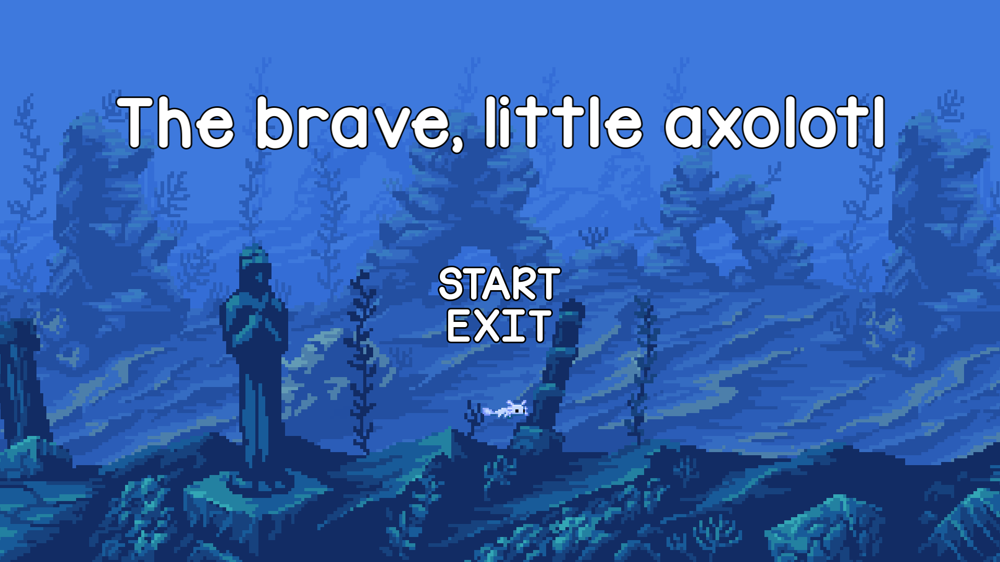

# The brave little axolotl
Project developed for university course - Object oriented programming.
Catamary damancy type game in underwater setting.

## Steering
Axolotl follows mouse coursor
Escape - pause menu on/off

## Used libraries
Project uses Simple and Fast Multimedia Library (SFML)

## Credits
+ Background - ansimuz https://ansimuz.itch.io/underwater-fantasy-pixel-art-environment
+ Fish sprites - Machanzo
+ Mouse cursor - Shubibubi https://shubibubi.itch.io/cozy-fishing
+ Sound effects - Falloutman
+ Alage, Garbage and Octopus sprite - Rapidpunches https://rapidpunches.itch.io/megamarinepack
+ Background music
	+ Alex089 https://opengameart.org/content/little-lullaby
	+ Ted Kerr https://opengameart.org/content/8-bit-rpg-battleencounter-theme
